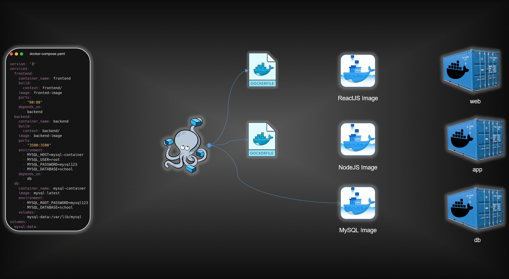

# SchoolSphere - Three-Tier Application (Dockerized)

<p align="center">
  
</p>



This repository demonstrates a **Three-Tier Application deployment using Docker**, consisting of:

* **Frontend** → React.js (served via Nginx)
* **Backend** → Node.js (Express API)
* **Database** → MySQL (initialized using SQL script)

The project is fully containerized and designed to reflect **real-world DevOps architecture**.

---

## 🔗 GitHub Repository

https://github.com/HarshavardhanBhosale/SchoolSphere-3Tier-DevOps.git

---

## 📦 Prerequisites

Make sure you have installed:

* Docker

---

## 📁 Project Structure

```
project-root/
│
├── backend/        # Node.js backend API
├── frontend/       # React frontend (served via Nginx)
├── mysql/          # MySQL Docker setup + SQL script
├── assets/         # Architecture images
```

---

## 🚀 Deployment Steps

### 1️⃣ Create Docker Network

```bash
docker network create three-tier-network
```

---

### 2️⃣ MySQL Database

```bash
cd mysql
docker build -t mysql-image .
docker run -d \
  --name mysql-container \
  --network=three-tier-network \
  -p 3306:3306 \
  -v mysql-data:/var/lib/mysql \
  mysql-image
```

> ✅ Database and tables are automatically created using the provided SQL script.

---

### 3️⃣ Backend (Node.js API)

```bash
cd ../backend
docker build -t backend .
docker run -d \
  --name backend-container \
  --network=three-tier-network \
  -p 3500:3500 \
  backend
```

---

### 4️⃣ Frontend (React + Nginx)

```bash
cd ../frontend
docker build -t frontend .
docker run -d \
  --name frontend-container \
  --network=three-tier-network \
  -p 80:80 \
  frontend
```

---

## 🌐 Access the Application

Open your browser and visit:

```
http://localhost:80
```

---

## 💾 Data Persistence

* MySQL data is persisted using Docker volumes (`mysql-data`)
* Even if the container is removed, data remains intact

---

## 🧠 Key Features

* Multi-container architecture (Frontend, Backend, Database)
* Docker-based deployment
* Pre-configured MySQL with initialization script
* Production-ready frontend using Nginx
* Clean separation of concerns (3-tier design)

---

## 🛠️ Notes

* Backend connects to MySQL using Docker network (not localhost)
* Ensure all containers are running on the same network (`three-tier-network`)
* SQL script inside the MySQL container initializes schema automatically

---

## 🚀 Future Improvements

* Add Docker Compose for simplified orchestration
* Implement CI/CD pipeline (GitHub Actions)
* Deploy on AWS (EC2 / ECS)
* Add monitoring (Prometheus + Grafana)

---

## 👨‍💻 Author

Harshavardhan Bhosale

---

Happy Coding 🚀

